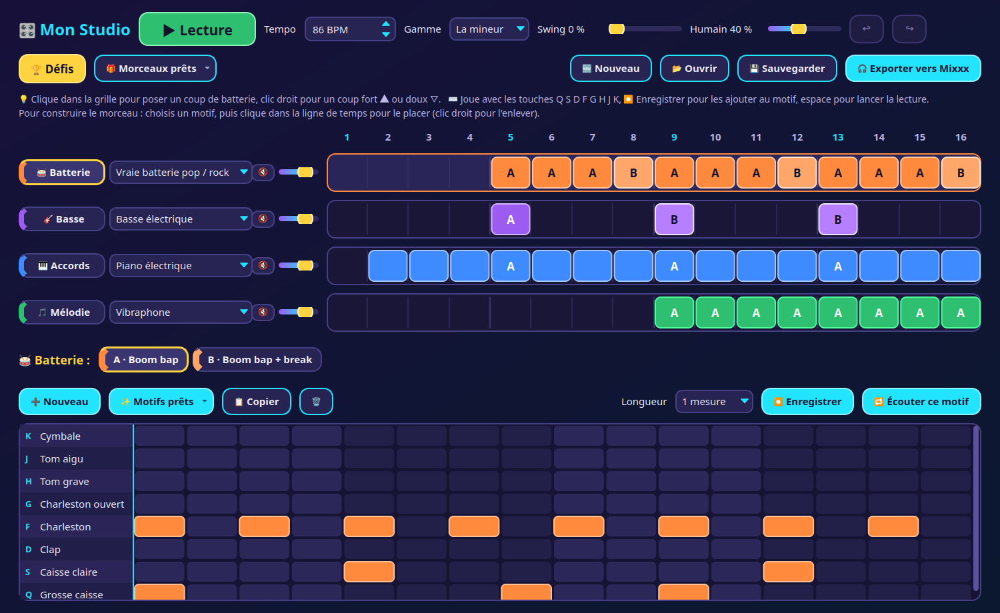
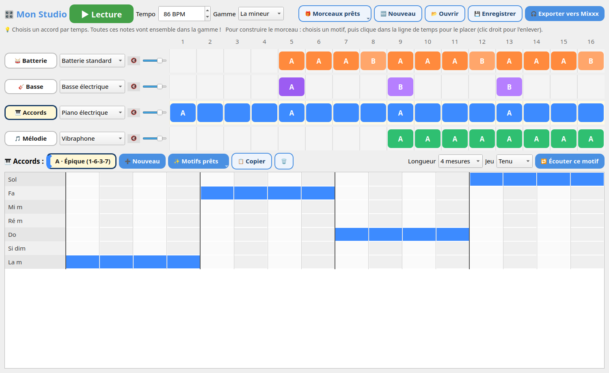
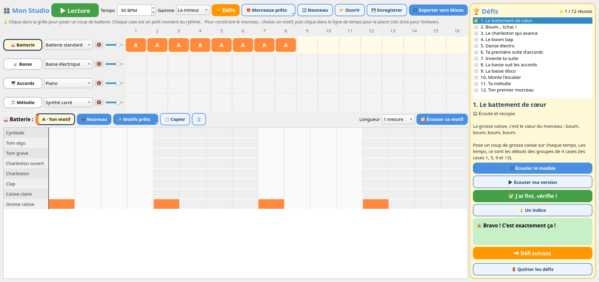

# Mon Studio

Une appli de bureau toute simple pour composer un morceau, pensée pour les enfants, dans l'esprit d'[Ableton Learning Music](https://learningmusic.ableton.com/fr/).



## Le principe

- **4 lignes** : 🥁 Batterie, 🎸 Basse, 🎹 Accords, 🎵 Mélodie.
- Chaque ligne a ses **motifs** (A, B, C…), qu'on édite sur une grille en bas de la fenêtre.
- En haut, une **ligne de temps** de 16 mesures : pour chaque ligne et chaque mesure, on choisit quel motif joue.

## Fait pour ne pas jouer faux

- La **mélodie** ne propose que les notes de la gamme choisie.
- Les **accords** se choisissent parmi ceux de la gamme (La m, Do, Fa, Sol…), joués tenus, rythmés ou en arpège.
- La **basse suit les accords** : « Note 1 » est toujours la base de l'accord du moment, donc n'importe quelle basse va avec n'importe quelle suite d'accords.
- Plusieurs cases à la suite font une note tenue ; chaque clic fait entendre la note.



## Pour démarrer vite

- **✨ Motifs prêts** : boom bap, pop rock, électro, funk, reggaeton, trap, roulements… ; suites d'accords pop, épique, émotion, jazz… ; basses et mélodies.
- **🎲 Au hasard** : remplit le motif choisi avec une idée qui sonne bien (batterie, basse, suite d'accords ou mélodie dans la gamme), une nouvelle à chaque clic ; ↩ Annuler pour revenir en arrière.
- **🎁 Morceaux prêts** : Hip-hop chill, Pop joyeuse, Électro, Reggaeton.
- **🔁 Écouter ce motif** fait tourner le motif en boucle pendant qu'on le modifie.

## 🥁 De vraies batteries

Les batteries « Vraie batterie » (pop / rock, rock, jazz, vintage) sont les kits [AVL Drumkits](https://www.bandshed.net/avldrumkits/) : de vraies batteries enregistrées à plusieurs forces de frappe, installées par le paquet `avldrums.lv2-soundfont`. Si elles manquent, Mon Studio utilise la batterie standard de la banque principale.

## 🎹 Des instruments soignés

Pour chaque instrument, Mon Studio prend la banque de sons la plus riche en enregistrements (mesuré dans les fichiers SF2) :

- **MuseScore General** : piano de concert (144 échantillons, ~19 min de son), cordes (414 échantillons), nappe, chœur, cuivres, guitare, basses ;
- **FluidR3** : vibraphone, flûte, boîte à musique, saxophone, violon, piano électrique ;
- **GeneralUser GS** : synthés et orgue.

Chaque instrument a une correction de volume mesurée pour qu'ils sonnent tous au même niveau. Chaque ligne a sa réverbe, son chorus et sa place dans la stéréo (accords un peu à gauche, mélodie un peu à droite), et l'export passe par un mastering léger (compression, limiteur, volume standard). Seuls les instruments utilisés sont chargés en mémoire.

## 🎶 Un jeu plus vivant

- **Accents** : clic droit sur une case allumée pour un coup **fort ▲**, puis **doux ▽**, puis normal.
- **Swing** : retarde régulièrement les doubles croches « faibles » pour faire balancer le rythme (hip-hop, jazz).
- **Humain** : petites imperfections aléatoires de placement (jusqu'à ±15 ms) et de force, comme un vrai musicien. À 0, tout est pile sur la grille.

## 🎚 Table de mixage et mode DJ

Devant chaque ligne de la ligne de temps, une petite table de mixage, qui marche aussi **pendant que le morceau joue** :

- **🔇** coupe la ligne, **⭐ Solo** n'écoute qu'elle (plusieurs solos possibles) : l'effet est immédiat, et une ligne coupée devient grise ;
- **Volume** ; avec le bouton **🎚 Table de mixage**, aussi **◀ ▶** (plus à gauche ou plus à droite) et **Écho** (comme dans une grande salle) ;
- le **Tempo** (case ou curseur) se change en pleine lecture, sans arrêt ni saut.

Les réglages sont gardés dans le morceau ; les anciens morceaux gardent leur son d'origine. L'export sonne exactement comme la lecture : les lignes coupées n'y sont pas (Mon Studio prévient avant d'exporter). Couper les accords ne change pas la basse, qui les suit toujours.

## 🛟 Sans risque

- **↩ Annuler / ↪ Rétablir** (Ctrl+Z, Ctrl+Y) ; un glisser dans la grille s'annule d'un coup.
- **Sauvegarde automatique** : le morceau revient tel quel au prochain lancement, même après une fermeture par erreur.

## ⌨ Jouer au clavier

Les touches de l'ordinateur jouent la ligne sélectionnée, par leur position (AZERTY comme QWERTY) :

- rangée du milieu **Q S D F G H J K L M** : la batterie (Q = grosse caisse, S = caisse claire…), la basse (Q = la base de l'accord du moment), les accords de la gamme, ou la mélodie ;
- rangée du dessus **A Z E R T Y U I O P** : la mélodie plus aiguë ;
- la note tient tant qu'on garde la touche, et sa ligne s'allume dans la grille ;
- **⏺ Enregistrer** fait tourner le motif en boucle et inscrit ce qu'on joue dans la grille, calé sur la case la plus proche ;
- **espace** lance ou arrête la lecture.

## 🏆 Le mode défi

Comme les leçons d'Ableton Learning Music, 12 petits défis progressifs : batterie (battement de cœur, backbeat, charleston, boom bap, électro), accords, basse, mélodie, puis un premier morceau complet.

- **🎧 Écoute et recopie** : on écoute le modèle (avec l'accompagnement quand il le faut) et on le reproduit dans la grille.
- **🎨 À toi de créer** : une consigne libre, par exemple « une suite qui commence et finit par La m » ou « une mélodie qui finit sur la note de base ».
- **✅ Vérifie !** donne un retour précis (« Il manque 2 coups sur Grosse caisse », « Mesure 3 : il faut l'accord Do »), **💡 Un indice** aide quand on bloque.
- La progression est gardée, et le morceau en cours est mis de côté puis retrouvé en quittant les défis.



## Et après

- **💾 Sauvegarder / 📂 Ouvrir** : les morceaux sont gardés en JSON dans `Musique/Mes créations/Projets`.
- **🎧 Exporter** : le morceau devient un MP3 « Mes créations - titre » dans `Musique/Mes créations`, prêt à être mixé dans [Mixxx](https://mixxx.org).

## Installation (Ubuntu / Debian)

```bash
sudo apt install python3-pyqt6 libfluidsynth3 fluid-soundfont-gm avldrums.lv2-soundfont musescore-general-soundfont-lossless ffmpeg
git clone https://github.com/ThibaultBrun/mon-studio.git
cd mon-studio
./install.sh
```

## Sous le capot

- `musique.py` : gammes, accords, motifs, modèles prêts, conversion du morceau en notes.
- `moteur.py` : FluidSynth via ctypes ; lecture en direct avec le séquenceur de FluidSynth (notes programmées 200 ms à l'avance), rendu WAV pour l'export.
- `defis.py` : les défis, leurs vérifications et la progression.
- `mon_studio.py` : l'interface PyQt6.

Les sons viennent de la banque [GeneralUser GS](https://github.com/mrbumpy409/GeneralUser-GS) (téléchargée par `install.sh`), avec la banque FluidR3 en secours.

## Licence

MIT, voir [LICENSE](LICENSE). Les banques de sons ont leur propre licence : GeneralUser GS (libre d'utilisation, y compris dans des logiciels) et FluidR3 GM (MIT).
